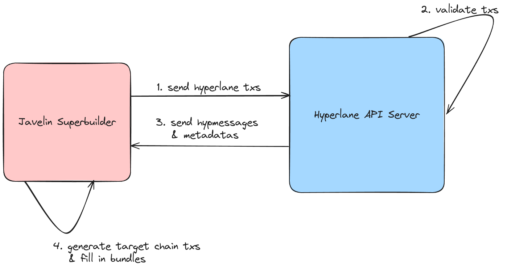

# Hyperlane-javelin

This repository contains the Javelin Superbuilder plugin dependent hyperlane APIServer and [WarpUI](./warp-ui). 

To fullfill the Javelin Superbuilder requirement of the instantly fill the target chain transactions in a cross rollup bundle for a hyperlane transfer or message, we chose to implement the API Server, which combines the functionality of Hyperlane Validators and Relayers. Once Javelin Superbuilder sends one or batch of hyperlane transaction, the API Server will populate the HypMessage and metameta needed for each transaction, by which we can generate the target chain transactions instantly. 

The API Server implemented at [./hyperlane-monorepo/rust/agents/apiserver](./hyperlane-monorepo/rust/agents/apiserver)
